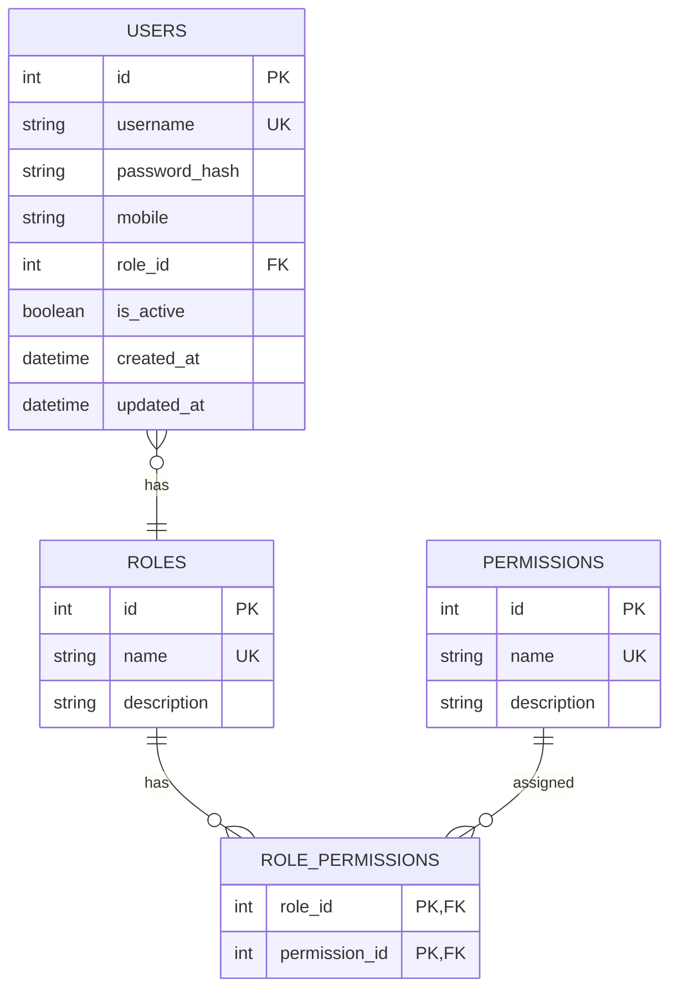

# Database Schema Documentation

## 1. ER diagram → understand relationships visually

## 2. Markdown tables → precise schema documentation

## Users

| Column | Data Type | Constraints | Description |
|---|---|---|---|
| id | INTEGER | PRIMARY KEY | Unique user identifier |
| username | VARCHAR(100) | UNIQUE, NOT NULL | User login name |
| password_hash | VARCHAR(255) | NOT NULL | Hashed user password |
| mobile | VARCHAR(20) | NULL | User's mobile phone number |
| role_id | INTEGER | FOREIGN KEY, NOT NULL | References the user's role |
| is_active | BOOLEAN | NOT NULL | Whether the user account is active |
| created_at | TIMESTAMP | NOT NULL | Account creation timestamp |
| updated_at | TIMESTAMP | NOT NULL | Last update timestamp |

## Roles

| Column | Data Type | Constraints | Description |
|---|---|---|---|
| id | INTEGER | PRIMARY KEY | Unique role identifier |
| name | VARCHAR(100) | UNIQUE, NOT NULL | Role name |
| description | TEXT | NULL | Role description |

## Permissions

| Column | Data Type | Constraints | Description |
|---|---|---|---|
| id | INTEGER | PRIMARY KEY | Unique permission identifier |
| name | VARCHAR(100) | UNIQUE, NOT NULL | Permission name |
| description | TEXT | NULL | Permission description |

## Role_Permissions

| Column | Data Type | Constraints | Description |
|---|---|---|---|
| role_id | INTEGER | PRIMARY KEY, FOREIGN KEY | References the role |
| permission_id | INTEGER | PRIMARY KEY, FOREIGN KEY | References the permission |

## 3. RBAC Relationships

The following mappings define which permissions are assigned to each role.

### Finance

Finance
 ├── read_finance
 └── read_general

### Marketing

Marketing
 ├── read_marketing
 └── read_general

### HR

HR
 ├── read_hr
 └── read_general

### Engineering
Engineering
 ├── read_engineering
 └── read_general

### C-Level
C-Level
 ├── read_finance
 ├── read_marketing
 ├── read_hr
 ├── read_engineering
 └── read_general

### Employee
Employee
 └── read_general